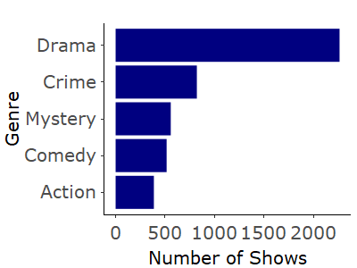

TV Ratings
================

<!-- README.md is generated from README.Rmd. Please edit that file -->

# tvrating

<!-- badges: start -->
<!-- badges: end -->

The goal of tvrating is to introduce the user to the package and aid
them with using it.

## Installation

You can install the development version of `tvrating` from
[GitHub](https://github.com/) with:

``` r
# install.packages("devtools")
devtools::install_github("ETC5523-2023/rpkg-bilallovesbatman")
```

# Loading the Package

To be able to use the package and access the data, the user must load
`tvrating` from the library and calling the object `tvrating`

# Use-case Examples

## Example 1: 5-Number Summary

This package contains functions that allows users to be able to process
or manipulate the data. As an example, the user can use the `summary_tv`
function to calculate the famous **five number summary** of the show
ratings (column: `av_rating`) i.e. minimum, Q1, median, Q3, maximum.
Returns NULL if inputs are less than a total of 5.

``` r
summary_tvrating(tv_ratings)
#>           Statistic   Value
#> 1           Minimum 2.70390
#> 2 1st Quartile (Q1) 7.73130
#> 3            Median 8.11485
#> 4 3rd Quartile (Q3) 8.48985
#> 5           Maximum 9.68240
```

## Example 2: Genre Distribution

Another example is being able to plot the genre distribution plot based
on the selected top genres using the filter. The user must use the
following command:

``` r
genre_plot(tv_ratings, selected_genre = 5)
```



The distribution of different genres is plotted based on the user’s
selection on the filter.
